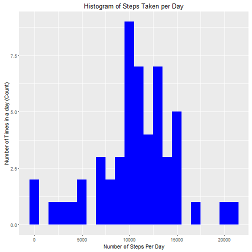
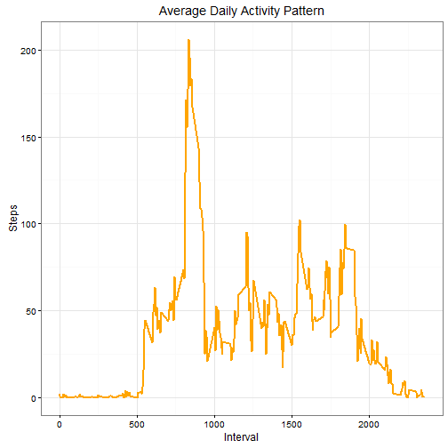
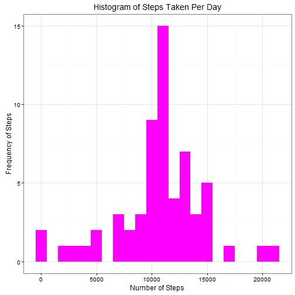
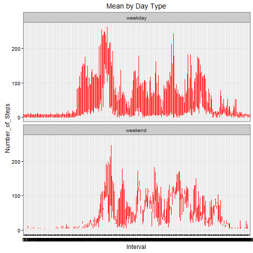

github repository = https://github.com/ivaturim/RR-Project1

## Introduction: 
This document presents the results of peer assessments 1 of course Reproducible Research on coursera. This assignment makes use of data from a personal activity monitoring device. This device collects data at 5 minute intervals through out the day. The data consists of two months of data from an anonymous individual collected during the months of October and November, 2012 and include the number of steps taken in 5 minute intervals each day.

This document presents the results of the Reproducible Research's Peer Assessment 1 in a report using a single R markdown document that can be processed by knitr and be transformed into an HTML file.

Through this report you can see that activities on weekdays mostly follow a work related routine, where we find some more intensity activity in little a free time that the employ can made some sport.

An important consideration is the fact of our data presents as a t-student distribution (see both histograms), it means that the impact of imputing missing values with the mean has a good impact on our predictions without a significant distortion in the distribution of the data.

## Prepare R Environment

Throughout this report when writing code chunks in the R markdown document, always use echo = TRUE so that someone else will be able to read the code.

First, we set echo equal a TRUE and results equal a 'hold' as global options for this document.


### Load Required Libraries


```r
library(lubridate)
library(ggplot2)
library(data.table)
```

## Loading the required data

This assignment makes use of data from a personal activity monitoring device. This device collects data at 5 minute intervals through out the day. The data consists of two months of data from an anonymous individual collected during the months of October and November, 2012 and include the number of steps taken in 5 minute intervals each day.

This assignment instructions request to show any code that is needed to loading and preprocessing the data, like to:

1. Load the data (i.e. > read.csv())
2. Process/transform the data (if necessary) into a format suitable for your analysis

### loading required data

The following statement is used to load the data using read.csv().


```r
dt <- read.csv("activity.csv", header = TRUE, sep = ",")
```

### Clean or Tidy the data

Convert the date into date data type and interva field to Factor class


```r
library(lubridate)
dt$date <- as.Date(dt$date, format = "%Y-%m-%d")
dt$interval <- as.factor(dt$interval)
```

##  Mean total number of steps taken per day

Now here we ignore the missing values of the dataset

### Total number of steps taken per day

below code gives total number of steps taken per day


```r
steps_per_day <- aggregate(steps~date, dt, sum)
colnames(steps_per_day) <- c("date","steps")
head(steps_per_day)
```

```
##         date steps
## 1 2012-10-02   126
## 2 2012-10-03 11352
## 3 2012-10-04 12116
## 4 2012-10-05 13294
## 5 2012-10-06 15420
## 6 2012-10-07 11015
```

### Histogram of the total number of steps taken each day

Below code plots histogram of the total number of steps taken each day


```r
ggplot(steps_per_day, aes(x= steps)) + 
  geom_histogram(fill = "blue", binwidth = 1000) +
  labs(title = "Histogram of Steps Taken per Day", 
        x = "Number of Steps Per Day", 
        y = "Number of Times in a day (Count)")
```



### Mean and median of the total number of steps taken per day

Below code cacluclates mean and median of number of steps taken per day


```r
steps_mean  <- mean(steps_per_day$steps, na.rm = TRUE)
steps_median <- median(steps_per_day$steps, na.rm = TRUE)
steps_mean
```

```
## [1] 10766.19
```

```r
steps_median
```

```
## [1] 10765
```

Mean is **10766.19** and Median is **10765**

## Average Dialy Pattern
### Calculating Steps Per Interval

The below code aggregates steps per interval and formats the same


```r
steps_per_inteval <- aggregate(dt$steps, 
                               by = list(interval = dt$interval), 
                               FUN = mean, 
                               na.rm = TRUE)
steps_per_inteval$interval <- as.integer(levels(steps_per_inteval$interval)[steps_per_inteval$interval])
colnames(steps_per_inteval) <- c("interval", "steps")
```

### Time series plot of the average number of steps taken

Below code generates a Time Series plot for averagge number of steps taken


```r
ggplot(steps_per_inteval, aes(x= interval, y = steps)) + 
  geom_line(color = "orange", size = 1) + 
  labs(title = "Average Daily Activity Pattern", 
       x = "Interval", 
       y = "Steps") + 
  theme_bw()
```


### The 5-minute interval that, on average, contains the maximum number of steps

Below code gives five minute interval that contains maximum number of steps

```r
max_interval <- steps_per_inteval[which.max(steps_per_inteval$steps),]
max_interval
```

```
##     interval    steps
## 104      835 206.1698
```

The **835th** interval has maximum **206** steps

## Imputing missing values

### Number of missing values

Below codes calculates number of missing values

```r
num_missing_values <- length(which(is.na(dt$steps)))
num_missing_values
```

```
## [1] 2304
```

The total number of **missing values** are **2304**

### Strategy for filling in all of the missing values in dataset

To populate missing values, we choose to replace them with the mean value at the same interval across days. In most of the cases the median is a better centrality measure than mean, but in our case the total median is not much far away from total mean, and probably we can make the mean and median meets.

below code doe this. 


```r
na_pos <- which(is.na(dt$steps))
mean_vec <- rep(mean(dt$steps, na.rm = TRUE), times = length(na_pos))
dt[na_pos, "steps"] <- mean_vec
```

### Histogram of the total number of steps taken each day after missing values are imputed

Below code plots histogram of the total number of steps taken each day after data is imputed

First aggregating steps per date after imputing the data


```r
fill_steps_per_day <- aggregate(steps~date, dt, sum)
```

Plotting the histogram


```r
ggplot(fill_steps_per_day, aes(x= steps)) + 
  geom_histogram(fill = "magenta", binwidth = 1000) + 
  labs(title = "Histogram of Steps Taken Per Day", 
       x = "Number of Steps", 
       y = "Frequency of Steps") +
  theme_bw()
```



### Mean and Median of the data after imputing

Below code generates mean and median of the data after imputing


```r
steps_mean_filling <- mean(fill_steps_per_day$steps, na.rm = TRUE)
steps_median_filling <- median(fill_steps_per_day$steps, na.rm = TRUE)
steps_mean_filling
```

```
## [1] 10766.19
```

```r
steps_median_filling
```

```
## [1] 10766.19
```

After Imputing the data both **mean** and **median** of the data is **10766.19**

## Difference of activity patterns between weekday and weekends

### creating new factor variables day_type

Below code adds additional columns to our data namely ***weekday*** and ***day_type***. While **weekday** tells which day of the week, **day_type** is the factor variable, which categorizes data into **weekday** or **weekend**


```r
trans_dt <- data.frame(date = dt$date, 
                       weekday = tolower(weekdays(dt$date)), 
                       interval =dt$interval, steps = dt$steps)
trans_dt <- cbind(trans_dt, 
                  day_type <- ifelse(trans_dt$weekday == "saturday" | 
                                       trans_dt$weekday == "sunday", "weekend", 
                                                                    "weekday"))
colnames(trans_dt) = c("date", "weekday", "interval", "steps", "day_type")
trans_dt <- data.frame(date = trans_dt$date, 
                       weekday = trans_dt$weekday, 
                       day_type = trans_dt$day_type, 
                       interval = trans_dt$interval, 
                       steps = trans_dt$steps)
head(trans_dt)
```

```
##         date weekday day_type interval   steps
## 1 2012-10-01  monday  weekday        0 37.3826
## 2 2012-10-01  monday  weekday        5 37.3826
## 3 2012-10-01  monday  weekday       10 37.3826
## 4 2012-10-01  monday  weekday       15 37.3826
## 5 2012-10-01  monday  weekday       20 37.3826
## 6 2012-10-01  monday  weekday       25 37.3826
```

### Caculating Mean steps by dat type

Below code aggregates steps data by **day_type** factor variable


```r
mean_day_type = aggregate(trans_dt$steps, 
                          by = list(trans_dt$day_type, 
                                    trans_dt$weekday,
                                    trans_dt$interval), 
                          mean)
names(mean_day_type) = c("day_type", 
                         "week_day", 
                         "interval", 
                         "mean")
head(mean_day_type)
```

```
##   day_type week_day interval     mean
## 1  weekday   friday        0 8.307244
## 2  weekday   monday        0 9.418355
## 3  weekend saturday        0 4.672825
## 4  weekend   sunday        0 4.672825
## 5  weekday thursday        0 9.375844
## 6  weekday  tuesday        0 0.000000
```

### Time Series Plot based on average number of steps taken, averaged across all weekday days or weekend days 

Below code plots time series plot on average number of steps taken, averaged across all weekday days or weekend days 


```r
ggplot(mean_day_type, aes(x= interval, y = mean)) +
  geom_line(color = "red") + 
  facet_wrap(~day_type, 
             nrow =2, 
             ncol = 1) + 
  labs(title = "Mean by Day Type", 
       x = "Interval" , 
       y = "Number_of_Steps") + 
  theme_bw()
```



## Good Practice - Delete all environment variables

It is always a best practice to delete all environment variables at the end, which helps in releasiing all blocked up memory of the system. 

Below code does this. 


```r
rm(list = ls())
```

